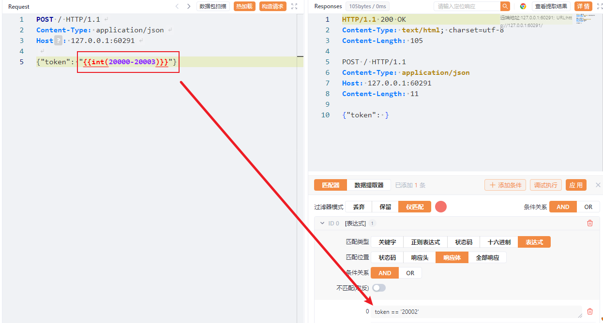
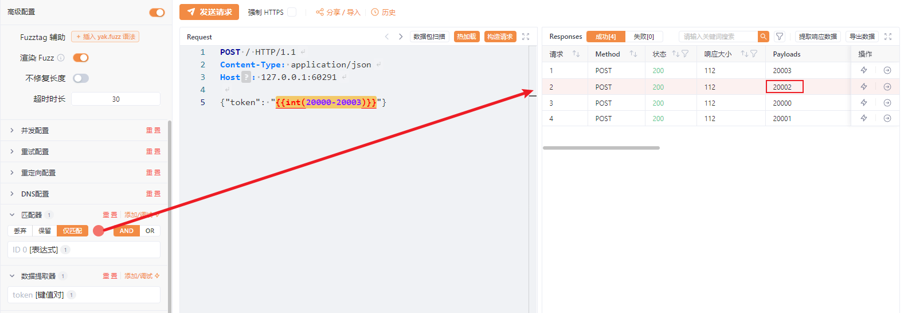
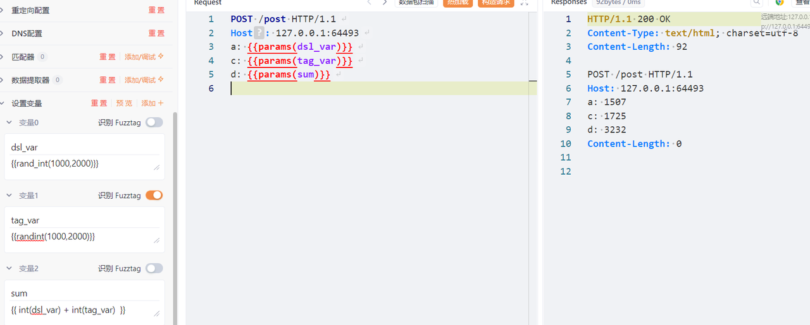

# Web Fuzzer 序列相关

在 Yakit 的众多模块中，MITM 和 Web Fuzzer 模块肯定是使用频率最高的，今天的主角就是我们的 Web Fuzzer 模块，在原有的功能基础上，我们给 Web Fuzzer 添加了一个被称为 Web Fuzzer 序列(Web Fuzzer Sequence)的功能，简单概括就是——Web Fuzzer 序列功能可以串联起多个 Web Fuzzer 节点页面，同时下级节点节点可以自由选择是否继承上级节点的变量(Cookie或其他数据)。
Web Fuzzer 序列基本是由 Web Fuzzer 页面中的数据提取器以及设置变量这个两个功能所组成的复合功能，接下来我们将首先介绍**数据提取器**和**设置变量**。

### 数据提取器

单从数据提取器来看，大家可能觉得功能十分的简单，不就是提取返回包中的一些值吗？但是其实它还有另一个功能——声明变量，直接看图说话：


图中红框中的 `data_0`就是提取结果后声明的变量名，用伪代码的方式可以像如下表示:

```go
data_0 = "提取的目标值"
```

熟悉代码的小伙伴应该马上能想到，既然都能声明变量了，那肯定也可以使用变量对吧！

没错，下面让我们配合匹配器功能来测试一下我们声明的变量该如何使用吧

首先，我们先启动一个 `MockEchoServer`，这个 `HTTP Server` 十分的简单，它会把我们发送的请求头、请求体，原封不动的放在返回包中


启动了这个MockEchoServer后，我们就可以很方便的进行调试了，现在我们可以设置一个数据提取器规则了，如下


解释一下我们设置的提取器，首先我们把原来的 `data_0`变量名修改为了`token`，其次我们的提取类型为键值对，提取范围为 `Raw`，也就是将提取的范围限定为整个返回包，最下方的 `token`则是特定键名了，我们通过token这个键名就可以获取到`1c544524-e8d8-42fd-921b-373c2345d201的值了`，点击调试执行，看看结果是否复合预期


那么我们上面设置的提取器规则，相当于是我们声明了一段代码：

```go
token = "1c544524-e8d8-42fd-921b-373c2345d201"
```

> 键值对的提取方式指的是从一个数据结构中获取或检索与特定键关联的值。这通常在编程中用于访问诸如字典（Dictionary）、哈希表（HashMap）或关联数组（Associative Array）等数据结构中的数据。

数据提取器的规则设置完毕了，接下来就是用匹配器来验证我们上面声明的变量是否可以使用了，我们设置一个如下的匹配器规则：



在这个匹配器规则中，我们选择了使用变量配合表达式语句进行匹配，箭头指向的 `token`就是我们在上一步中声明的变量(token)，那么这个匹配器规则配合之前的提取器规则的伪代码如下：

```go
// 使用 {{int(20000-20003)}} 会发送四个包
for req in [req1 , req2 , req3 , req4]{
    rsp,_ = poc.HTTP(req)~
    // 提取器 从 body 中提取 {"token":"20000"} 的值
    token = 键值对提取器(rsp.body,"token") // token = "20002"
    // 匹配器 使用我们输入的表达式
    if 表达式匹配器(`token == "20002"`){
        println("匹配成功")
    }
}
```


我们发送一下请求，查看结果发现，匹配器成功的使用了提取器的获取的值进行了表达式的判断



我们现在把表达式的值由原来的 `token == '20002'`改为`token != '20002'`后继续测试，结果完美符合预期！


### 设置变量

在上面的数据提取器中，我们已经介绍了如何声明变量，那么接下来我们就来介绍如何另一种声明变量的方式——直接在 Web Fuzzer 中`设置变量` ，下面我们直接对应着发包来介绍一下这种方式。



上图分别设置了三个变量，分别是
1. `dsl_var` 未开启 `Fuzztag` 识别，同时变量的值被包裹在{{}}中则默认使用的是 `nuclei dsl`的方法，此处使用的是 `rand_int(1000,2000)`，表示生成一个范围在 `1000` 到 `2000` 的随机数。
2. `tag_var` 开启 `Fuzztag` 识别，则可以使用 `yak` 原生支持的 `fuzztag` 标签了
3. `sum` 稍微有点不一样，`sum`的值是由上面的两个变量